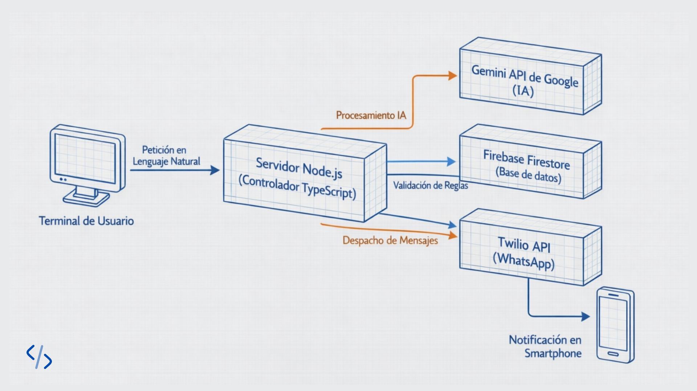

# 🎯 Focus Guard MCP

Sistema de gestión de productividad orientado al **control de foco**, 
la **automatización de reglas de negocio** y el **seguimiento de proyectos**, 
utilizando **IA únicamente como apoyo para interpretar entradas en lenguaje natural**.

El sistema está diseñado como proyecto de aprendizaje y portafolio técnico, 
priorizando decisiones determinísticas, claridad arquitectónica y buenas prácticas.

---

## 📋 Características

### 🤖 Interpretación de lenguaje natural (IA como apoyo)
- **Parsing con Gemini AI**: la IA se utiliza exclusivamente para extraer estructura
  (nombre de proyecto, tareas, horas estimadas) desde texto libre ingresado por el usuario.
- **Validación por reglas de negocio**: todas las decisiones del sistema son determinísticas
  y no dependen de la IA.
- **Restricción de foco**: solo se permite **un proyecto activo a la vez** para evitar
  sobrecarga y dispersión.

### 🔥 Persistencia y estado (Firebase)
- Base de datos en tiempo real con **Firestore**
- Persistencia de proyectos y tareas
- Consultas optimizadas mediante índices

### 📲 Alertas por WhatsApp
- Notificaciones automáticas mediante **Twilio**
- Auditoría diaria de proyectos inactivos
- Alertas cuando un proyecto lleva más de **48 horas sin actividad**

### 📊 Sistema de auditoría
- Monitoreo automático de proyectos activos
- Cálculo de inactividad basado en timestamps

---

## 🛠️ Arquitectura del Sistema

*El flujo muestra cómo Node.js centraliza la comunicación entre el usuario, la inteligencia de Gemini, el estado en Firebase y las alertas de Twilio.*

---

## 🚀 Instalación

### **Requisitos Previos**
- Node.js >= 18.x
- Cuenta de Firebase (con Firestore activado)
- API Key de Google Gemini
- Cuenta de Twilio (para WhatsApp)

### **1. Clonar el repositorio**
```bash
git clone https://github.com/tu-usuario/focus_guard_mcp.git
cd focus_guard_mcp
```

### **2. Instalar dependencias**
```bash
npm install
```

### **3. Configurar variables de entorno**

Crea un archivo `.env` en la raíz del proyecto:

```env
# Google Gemini AI
GEMINI_API_KEY=tu_api_key_de_gemini

# Twilio (WhatsApp)
TWILIO_ACCOUNT_SID=tu_account_sid
TWILIO_AUTH_TOKEN=tu_auth_token
TWILIO_PHONE_FROM=whatsapp:+14155238886
MY_PHONE_NUMBER=whatsapp:+521234567890
```

### **4. Configurar Firebase**

1. Ve a [Firebase Console](https://console.firebase.google.com/)
2. Crea un nuevo proyecto o selecciona uno existente
3. Habilita **Firestore Database**
4. Ve a **Project Settings > Service Accounts**
5. Genera una nueva clave privada (JSON)
6. Guarda el archivo como `firebase-credentials.json` en la raíz del proyecto

---

## 📂 Estructura del Proyecto

```
focus_guard_mcp/
├── src/
│   ├── assets/            # Recursos estáticos (imágenes, diagramas)
│   │   └── Focus_Guard_MCP.png  # Diagrama de arquitectura del sistema
│   ├── auditor.ts         # Sistema de auditoría diaria
│   ├── firebase.ts        # Configuración y prueba de Firebase
│   ├── gemini.ts          # Configuración de Gemini AI
│   ├── list-models.ts     # Utilidad para listar modelos disponibles
│   ├── strict_boss.ts     # Sistema principal con validación de proyectos
│   ├── tools.ts           # Function Calling para tareas
│   └── whatsapp.ts        # Envío de alertas por WhatsApp
├── .env                   # Variables de entorno (NO subir a git)
├── .gitignore             # Archivos ignorados por git
├── firebase-credentials.json  # Credenciales de Firebase (NO subir a git)
├── package.json           # Dependencias del proyecto
├── tsconfig.json          # Configuración de TypeScript
└── README.md              # Este archivo
```

---

## 🎮 Uso

### **Ejecutar el sistema principal**
```bash
npx ts-node src/strict_boss.ts
```

Este script:
- Evalúa si puedes crear un nuevo proyecto
- Valida que solo tengas 1 proyecto activo
- Usa IA para extraer datos del lenguaje natural
- Crea proyectos en Firebase

### **Crear una tarea con IA**
```bash
npx ts-node src/tools.ts
```

Ejemplo de entrada:
> "Por favor recuérdame que tengo que comprar leche y pan, guarda esta tarea en mi proyecto Personal."

La IA extrae automáticamente:
- **Título**: "Comprar leche y pan"
- **Proyecto**: "Personal"

### **Ejecutar auditoría diaria**
```bash
npx ts-node src/auditor.ts
```

Analiza todos los proyectos activos y envía alertas por WhatsApp si alguno lleva >48h sin actualizarse.

### **Listar modelos de Gemini disponibles**
```bash
npx ts-node src/list-models.ts
```

Útil para verificar qué modelos puedes usar con tu API key.

### **Probar conexión a Firebase**
```bash
npx ts-node src/firebase.ts
```

Crea una tarea de prueba y consulta tareas completadas.

### **Enviar alerta de prueba**
```bash
npx ts-node src/whatsapp.ts
```

---

## 🛠️ Tecnologías

| Tecnología | Uso |
|------------|-----|
| **TypeScript** | Lenguaje principal |
| **Node.js** | Runtime |
| **Firebase Admin SDK** | Base de datos (Firestore) |
| **Google Generative AI** | Function Calling con Gemini |
| **Twilio** | Notificaciones por WhatsApp |
| **dotenv** | Gestión de variables de entorno |

---

## 📖 Ejemplos de Uso

### **Crear un proyecto con validación**

```typescript
// El usuario escribe en lenguaje natural:
"Quiero empezar mi Portfolio Web, me tomará unas 20 horas."

// La IA extrae automáticamente:
{
  nombre: "Portfolio Web",
  horasEstimadas: 20
}

// El sistema valida:
✅ APROBADO: No hay proyectos activos
   → Crea el proyecto y marca como ACTIVE

// Si ya hay un proyecto activo:
⛔ DENEGADO: Ya tienes "Portfolio Web" activo
   → Por reglas de productividad, solo 1 proyecto a la vez
```

### **Auditoría automática**

```typescript
// Cada día, el sistema revisa:
Proyecto "Portfolio Web":
  - Última actualización: Hace 50 horas
  - Estado: ACTIVE
  
🚨 Alerta enviada por WhatsApp:
   "⚠️ PELIGRO: El proyecto 'Portfolio Web' lleva más de 48h 
    abandonado. ¿Lo pausamos o vas a trabajar hoy?"
```

---

## 🔒 Seguridad

**⚠️ NUNCA subas estos archivos a repositorios públicos:**
- `.env` (contiene API keys)
- `firebase-credentials.json` (credenciales privadas)

Estos archivos ya están en `.gitignore`.

---

## 🐛 Troubleshooting

### **Error: "GoogleGenerativeAI Error: 403 Forbidden"**
- Verifica que tu `GEMINI_API_KEY` esté correcta en `.env`
- Asegúrate de usar un modelo válido (ej: `gemini-3-flash-preview`)

### **Error: "The default Firebase app already exists"**
- El código ya incluye validación con `if (!admin.apps.length)`
- Si persiste, reinicia el proceso de Node.js

### **Error: Variables de entorno undefined**
- Verifica que el archivo `.env` esté en la raíz del proyecto
- Asegúrate de que `dotenv.config()` se llame antes de usar las variables

### **No recibo alertas de WhatsApp**
- Verifica tu configuración de Twilio
- El número debe incluir el prefijo `whatsapp:` (ej: `whatsapp:+521234567890`)
- Asegúrate de que tu número esté vinculado en Twilio Sandbox

---


## 📄 Licencia

ISC

---

## 👤 Autor

- GitHub: [@wartu95](https://github.com/wartu95)

---

## 🙏 Agradecimientos

- Google Gemini AI por el potente API de IA
- Firebase por la infraestructura en la nube
- Twilio por las notificaciones en tiempo real

---

**¡Hecho con ❤️ para mantener el foco y la productividad!**
